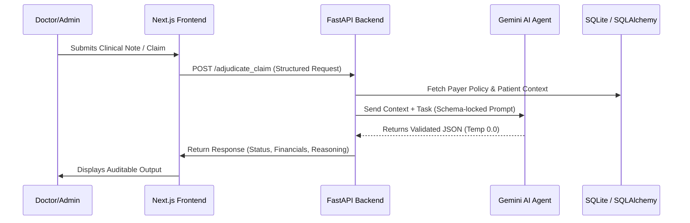

# MedWeave AI: Technical Architecture Document

MedWeave AI is a multi-agent ecosystem designed for high-integrity healthcare operations. The system uses a **Synchronous Agent Coordination** pattern, where specialized LLM-based agents are orchestrated by a central FastAPI backend to handle clinical and administrative tasks.

---

## 1. Agent Roles & Responsibilities

The system consists of four primary AI Agent roles, each with a specialized "System Instruction" and deterministic execution profile.

| Agent Role | Responsibility | Input | Output |
| :--- | :--- | :--- | :--- |
| **Clinical Guardian** | Real-time session monitoring and risk detection. | Live Voice Transcription | Structured Risk Alerts (SAFE/WARNING/DANGER) |
| **EHR Encoder** | Mapping raw clinical notes to standardized codes. | Clinical Summary | ICD-10 & CPT Codes + Reasoning |
| **Claim Adjudicator** | 6-step financial and policy validation. | Claim Data + Policy Ref | Adjudication JSON (Status, Splits, Audit) |
| **Prior Auth Evaluator** | Case-based service request matching. | Patient History + Request | Auth Action (AUTHORIZED/DENIED) + Rationale |

---

## 2. Communication Flow

MedWeave AI follows a **Request-Response Agent Pattern** to ensure data integrity and auditability.

---

## 3. Tool & Data Integrations

- **Clinical Database**: SQLite via SQLAlchemy for persistent storage of patient IDs, medical history, and encounter logs.
- **LLM Gateway**: Google Gemini Pro 1.5 API, accessed via a deterministic configuration.
- **Data Validation**: Pydantic v2 is used as a middleware layer to ensure that AI outputs exactly match the required JSON schemas before being served to the UI.

---

## 4. Error Handling & Reliability Logic

### **4.1. The Checksum Pattern**
For financial adjudication, the system performs a post-agent calculation check. If `insurance_payable + patient_responsibility != total_allowed`, the system catches the discrepancy before display.

### **4.2. Graceful Degradation**
If the AI service is unavailable or credit-limited:
- **Fallback**: The backend returns a "Pending Review" status rather than a failure, allowing manual human intervention.
- **Token Management**: Strict token limits (`max_tokens=1024`) are enforced to prevent request timeouts and account exhaustion.

### **4.3. Determinism Control**
All operational agents are locked at **Temperature 0.0** to eliminate the "hallucination variance" common in standard chatbots, ensuring that the same clinical input always yields the same financial output.

---

## 5. Security & Privacy
- **JWT (Stateless Auth)**: Ensures only authorized medical personnel can trigger agent workflows.
- **PII Isolation**: Agents only receive the minimum necessary data (e.g., Patient ID instead of full Bio) to perform their specific tasks, maintaining a strong privacy boundary.
